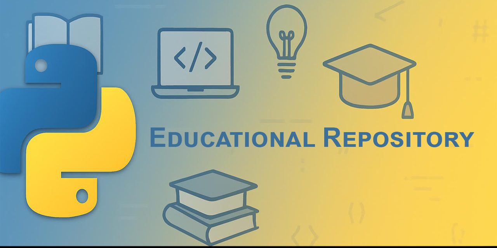

> [!NOTE]
> Educational Repository / Izglītības nolūkiem paredzēts repozitorijs

## 2.Nedēļa Python mājasdarbs

Tēma: **Dati, nosacījumi un cikli**

Commits below:
```
* 717cb65 (HEAD -> main, origin/main, origin/feature/week2-homework, orgin, feature/week2-homework) fix: added git log to readme
* 383681a fix: readme data formatting adjusted
* 3cf4047 docs: readme and misc image for readme
* 3af8e1f fix: Guess game - added option to quit game, also added validation that user must input int from 1 to 100
* 8aaa6fb feat: Guess game - added repeat option, game in final stage
* 112e4ef fix: Guess game - only accepts 10 tries and also returns how many tries are left
* d104739 feat: added Guess game that let's You guess number from 1 to 100, currently without retry functionality
* c89e835 feat: added FizzBuzz - that returns int value or str if number that is looped through range  divides by 7,5 or 3
* de67d21 feat: add Eligibility - that collects user input and returns Eligibility for couple of options
* 376a60c feat: added Converter - KM/MI, KG/LB, L/GAL, DOL/EUR
* 453d901 feat: add Type Explorer with truthy/falsy examples, comments in latvian
```

## Latviešu valodā

### Mērķis
Šis repozitorijs ir paredzēts tikai un vienīgi **izglītības nolūkiem** kā daļa no **pašvadītas mācīšanas procesa ar mentoru**.  
Tajā iekļauti materiāli, uzdevumi un kods, kas izstrādāts šī mācību procesa.

### Piekļuve un izmantošana
Repozitorijs ir kopīgots tikai ar autorizētām personām, izmantojot konkrēto repozitorija saiti.  
Saturs ir paredzēts tikai izglītības vajadzībām, pašvadītai mācīšanai ar mentora vadību, sadarbībai starp apstiprinātiem dalībniekiem.

### Ierobežojumi
- Repozitorija vai tā satura tālāka izplatīšana bez atļaujas ir aizliegta.  
- Komerciāla izmantošana ir aizliegta.  
- Dalīšanās ar saturu ārpus paredzētās auditorijas nav pieļaujama.

## English

### Purpose
This repository is intended strictly for **educational purposes** as part of a **self-directed learning process with a mentor**.  
It contains materials, exercises, and code developed during this learning process.

### Access & Usage
This repository is shared only with authorized individuals via the provided repository link.  
The content is intended solely for educational use, self-directed learning with guidance from a mentor, collaboration among approved participants.

### Restrictions
- Redistribution of this repository or its contents without permission is not allowed.  
- Commercial use is prohibited.  
- Sharing outside the intended audience is discouraged.

---